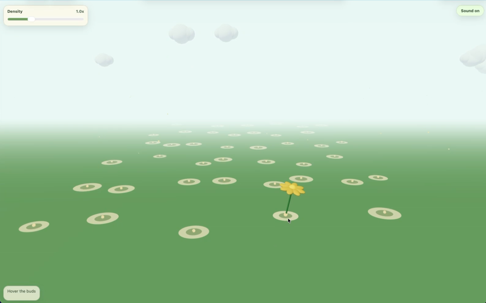

# SDF Ray Marching Garden — Devlog, May 14

Today I built the first interactive Three.js prototype for **SDF Ray Marching Garden** from scratch. The current version is still raster-rendered, but it establishes the interaction and architecture we need before moving the visual core toward signed distance fields and ray marching.

## Current Progress

The scene now has a quiet 3D garden layout with pre-planted flower spots. Hovering over a spot grows a small 3D flower, leaving the spot shrinks it back, and each bloom can trigger a soft musical note. A density slider controls how many flower points are distributed across the field, and the UI stays deliberately minimal so the scene remains the focus.

The project is organized around a production-style separation of concerns: `simulation/` owns the garden state, `interaction/` converts pointer movement into hover events, `audio/` handles browser sound, `ui/` owns DOM controls, and `render/` turns pure state into Three.js objects. This mirrors a common real-time graphics pattern: keep gameplay/interaction state independent from the render graph so future renderers can be swapped in without rewriting the whole application.

## Rendering Direction

The long-term goal is to optimize rendering through SDF ray marching inside a dynamic interactive scene. Lighting is the main selling point: SDFs naturally support effects that are often awkward in ordinary rasterization, including soft shadows by tracking minimum distance along a shadow ray, ambient occlusion by sampling short distances along the surface normal, translucent petal effects where light leaks through from the back side, and eventually more global illumination experiments.

## Research Notes

- **Cook-Torrance reflectance, 1982:** A foundational microfacet BRDF model for physically motivated specular reflection, useful for grounding future material work in roughness, Fresnel response, and geometric attenuation. [Source](https://cir.nii.ac.jp/crid/1360574094175843328)
- **Penner / Borshukov pre-integrated skin shading:** A real-time subsurface scattering approach that pre-integrates scattered light into local shading data instead of running expensive diffusion passes, which is relevant to glowing translucent petals. [Source](https://www.gameenginegems.net/gemsdb/article.php?id=1103)
- **Crytek SSAO / CryEngine 2:** An influential real-time ambient occlusion direction that showed how screen-space depth sampling can add contact darkness and spatial grounding at interactive frame rates. [Source](https://docslib.org/doc/9409855/finding-next-gen-cryengine-2)
- **Toth and Umenhoffer, 2009:** A GPU method for real-time volumetric light shafts in participating media using shadow maps and interleaved sampling, relevant to future fog and garden light beams. [Source](https://diglib.eg.org/items/07d33179-3056-49d8-b404-c13be46c8baf)
- **Wronski, 2014:** A production-oriented volumetric fog direction for unified atmospheric scattering in a real-time game renderer, useful as a practical reference for scalable volumetric lighting. [Source](https://bartwronski.com/2014/08/)

## Current Study Material

I am using Inigo Quilez's SDF articles as the main learning path, especially his distance-function references and ray-marched soft shadow / ambient occlusion techniques. The immediate next step is to prototype a small SDF object or flower petal shader beside the current Three.js mesh version, then compare how ray-marched lighting changes the feel of the garden. [SDF article index](https://iquilezles.org/articles/) / [Soft shadows](https://iquilezles.org/articles/rmshadows/)

## Next Steps

The next milestone is a hybrid renderer: keep the current Three.js interaction layer and scene management, but add an experimental shader pass for SDF flower forms. Once the SDF pass is stable, I want to test soft shadows, normal-based AO, and a simple translucent-petal lighting model before moving toward heavier global illumination experiments.
